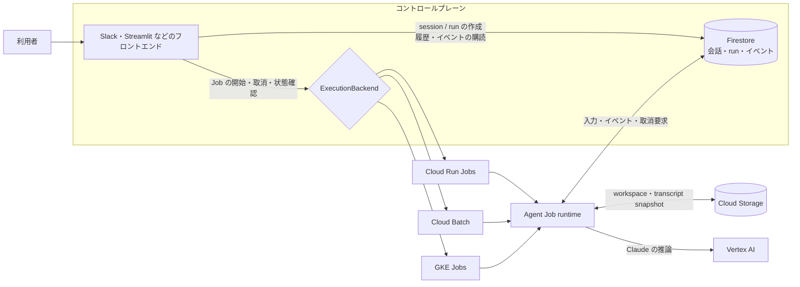

# Claude Agent SDK on Google Cloud Hosting

Claude Agent SDK を使った長時間実行エージェントを、利用者自身の Google Cloud 環境でホスティングするための実装です。1 回のエージェント実行（run）を 1 つの Job として起動し、実行状態と会話履歴を永続化します。

実行基盤は、運用要件に合わせて次の 3 つから選べます。

| 実行基盤 | 向いているケース | セットアップ |
| --- | --- | --- |
| Cloud Run Jobs | サーバーレスで構成をシンプルに保ちたい | [Cloud Run Jobs](docs/setup-cloud-run-jobs.md) |
| Cloud Batch | マシンタイプや計算資源を run ごとに明示したい | [Cloud Batch](docs/setup-cloud-batch.md) |
| GKE Jobs | 既存の GKE クラスター、NodePool、Kubernetes 運用を利用したい | [GKE Jobs](docs/setup-gke-jobs.md) |

どの基盤を選んでも、フロントエンドとエージェント本体は共通のインターフェースを利用します。バックエンドを切り替えても、Firestore の会話履歴や GCS の workspace は引き続き利用できます。

## アーキテクチャ



- Firestore の名前付き database が user、session、run、event の正本です。
- GCS は workspace と Claude transcript の snapshot を保存します。
- フロントエンドは Job の起動と画面表示を担当し、エージェント処理そのものは選択した実行基盤で動きます。
- Job へ渡す識別子は `RUN_ID` だけです。prompt や取消要求は Firestore から取得し、API key ではなく Google Cloud のサービスアカウントで Vertex AI を利用します。

詳しい責務分担と、再訪・キャンセル・障害時の流れは [アーキテクチャと Job 運用](docs/architecture-and-job-operations.md) を参照してください。

## 導入の流れ

1. `example/agent/runtime.py` を基に、system prompt、model、tools、workspace の初期化処理を用途に合わせて変更します。
2. `example/Dockerfile` で Job image を build し、利用するコンテナレジストリへ push します。
3. 3 つの実行基盤から 1 つを選び、release YAML と Terraform を適用します。
4. `ChatService` または `ControlClient` を組み込んだ、用途に合わせたフロントエンドをホスティングします。

このリポジトリの Terraform は Job、Firestore、GCS、IAM などのバックエンドを構築します。利用者がアクセスするフロントエンドは別途用意してホスティングしてください。実装の変更箇所と再利用できるサンプルは [エージェントとフロントエンドのカスタマイズ](docs/customizing-agent-and-frontends.md) にまとめています。

## フロントエンドのサンプル

配備済みのバックエンドへ接続できるサンプルとして、Streamlit、Slack、CLI を用意しています。

```bash
gcloud auth application-default login
uv sync --group streamlit
uv run streamlit run example/streamlit_frontend/app.py
```

Streamlit のサイドバーで release config と User ID を指定すると、session の作成、イベントのストリーミング表示、過去の会話への再訪、実行中 run のキャンセルを確認できます。Slack と CLI の起動方法、独自 UI へ組み込む際の境界は [カスタマイズガイド](docs/customizing-agent-and-frontends.md) を参照してください。

完了イベントに SDK の利用情報が含まれる場合、サンプル UI は推定費用と SDK 処理時間も表示します。これらは参考値であり、正式な利用料金は Google Cloud Billing で確認してください。

## ドキュメント

- [ドキュメント一覧](docs/README.md)
- [Cloud Run Jobs のセットアップ](docs/setup-cloud-run-jobs.md)
- [Cloud Batch のセットアップ](docs/setup-cloud-batch.md)
- [GKE Jobs のセットアップ](docs/setup-gke-jobs.md)
- [アーキテクチャと Job 運用](docs/architecture-and-job-operations.md)
- [エージェントとフロントエンドのカスタマイズ](docs/customizing-agent-and-frontends.md)

## 開発者向け

ライブラリ本体や Terraform を変更する場合は、次を実行してください。

```bash
uv sync --group dev
uv run pytest
terraform -chdir=terraform init -backend=false
terraform -chdir=terraform validate
```
