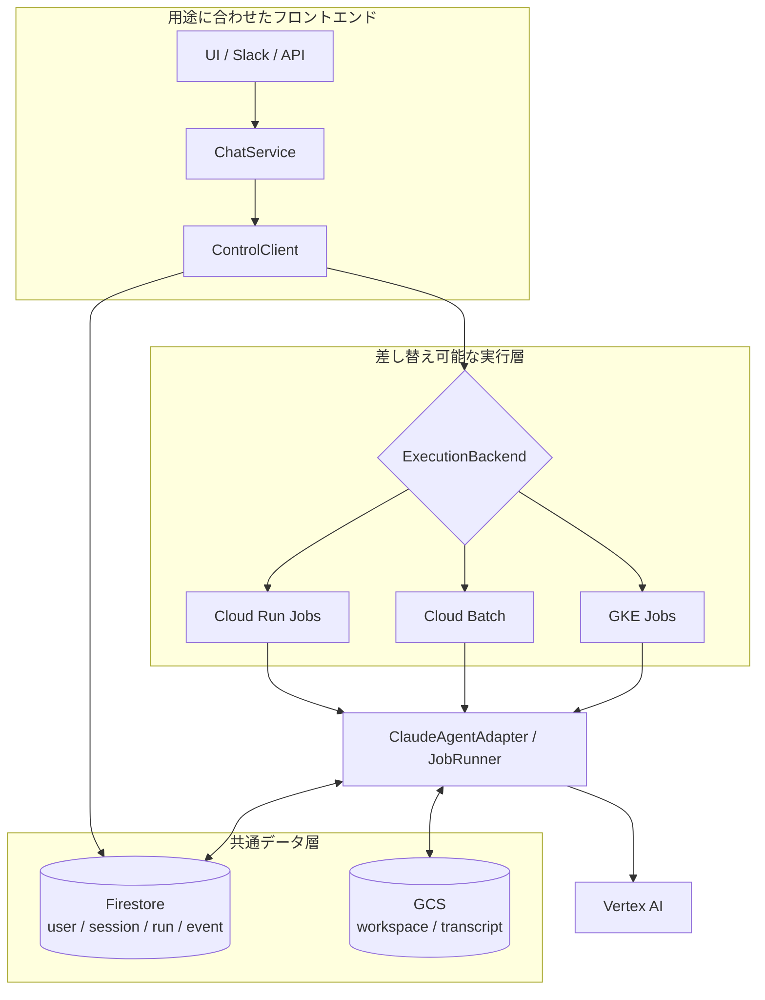
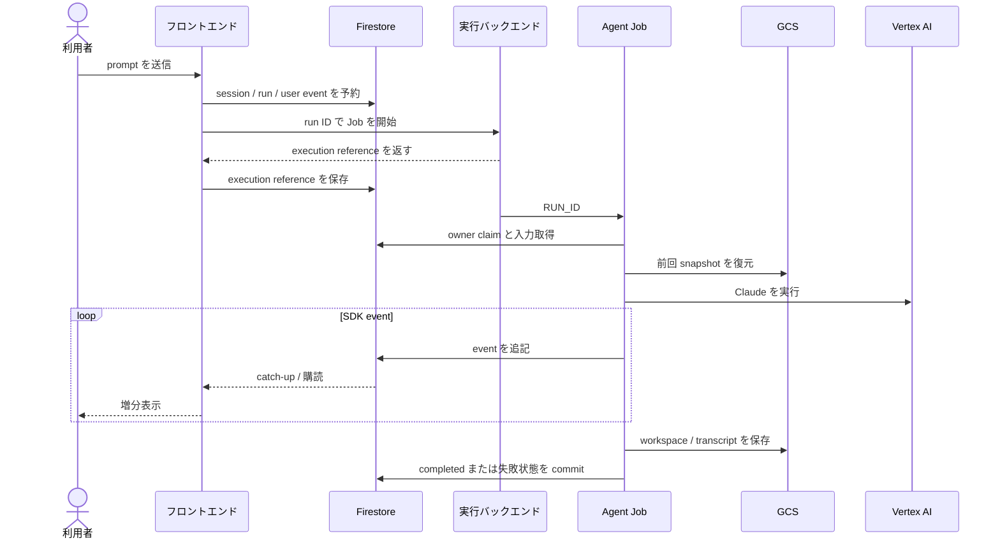

# アーキテクチャと Job 運用

## コンポーネントの責務

| コンポーネント | 責務 |
| --- | --- |
| Slack・Streamlit・独自 UI など | 利用者の認証、入力、イベント表示、再訪、キャンセル操作 |
| `ChatService` | session/run の開始、保存済みイベントの catch-up、購読、重複排除、終端判定 |
| `ControlClient` | Firestore と実行バックエンドをまたぐ開始・取消・reconcile |
| Firestore | session、run、event、質問、取消要求の正本 |
| `ExecutionBackend` | Cloud Run Jobs、Cloud Batch、GKE Jobs の差異を吸収 |
| Job runtime | run の claim、エージェント実行、イベント保存、snapshot、終端 commit |
| GCS | workspace と Claude transcript の snapshot |

フロントエンドと Job runtime は Firestore を介して疎結合になっています。画面を閉じても Job は選択した実行基盤で継続し、再訪時は永続化済みの状態から表示を復元できます。

## run の開始とイベント表示

実行バックエンドの開始は at-least-once になり得ますが、run ID から導出した実行 ID と Job runtime の owner claim により、同じ run の Claude 実行を同時に 1 件へ制限します。

## 再訪

フロントエンドは、画面のメモリを会話履歴の正本にしません。再訪時は次の順序で復元します。

1. user ID で session 一覧を取得する。
2. session に属する run と保存済み event を読み直す。
3. active な run は `reconcile(run_id, holder=...)` で実行基盤の状態を確認する。
4. 最後に受け取った cursor 以降を購読し、保存済みイベントとの重複を event ID で除外する。

Streamlit と Slack のサンプルは、この処理を共通の `example.chat.ChatService` に集約しています。

## キャンセル

フロントエンドは UI の操作を `ControlClient.cancel(run_id)` へ渡します。処理は次の 2 段階です。

1. Firestore に取消要求を永続化する。
2. 選択したバックエンドへ Cloud Run Execution の cancel、Batch Job の delete、または Kubernetes Job の delete を要求する。

先に取消要求を永続化するため、バックエンド側の Job が既に消えていても、reconciler は run を `cancelled` へ収束できます。Job runtime も Firestore の取消要求を確認します。

## 障害と reconcile

Job の失敗、取消、実行 resource の消失は、Firestore の run と自動的に同時更新されるとは限りません。フロントエンドまたは外部ポーラーから `ControlClient.reconcile(run_id, holder=...)` を呼び、実行基盤の状態を Firestore の終端状態へ補正します。

- 実行 resource が失敗していれば run を `failed` にする。
- 取消要求後に resource が消えていれば run を `cancelled` にする。
- 取消要求なしで resource が消えていれば run を `failed` にする。
- 実行基盤が成功でも final event または snapshot がなければ永続化失敗として扱う。
- 一時的な provider API エラーでは active 状態を維持し、次回の reconcile に委ねる。

サンプル UI は表示中の run を reconcile します。画面を開いていない run も継続監視する本番構成では、同じ契約を呼び出す定期ポーラーを別途運用してください。

## 保持期間と利用情報

`retention_days` は Firestore の session、run、event と、GCS の workspace、transcript、一時 object に共通で適用されます。Firestore TTL と GCS lifecycle の物理削除は非同期です。

SDK が `total_cost_usd` または `duration_ms` を返した場合は run の結果に保存でき、サンプル UI は推定費用と SDK 処理時間として表示します。Cloud のキュー待ち、workspace 復元、snapshot 保存を含む全体時間や、正式な請求額ではありません。正式な料金は Google Cloud Billing で確認してください。

## ログと監視

Job runtime は `job.start`、owner claim、SDK query 開始、event 保存、正常終了または失敗を structured message として Cloud Logging へ出力します。prompt や tool payload は通常ログへ出さない方針を維持してください。

最低限、次を監視対象にします。

- backend ごとの Job 失敗数と timeout
- Firestore 上で長時間 active のままの run
- reconcile による `failed`、`cancelled`、永続化失敗への遷移
- Firestore、GCS、Vertex AI の quota と権限エラー
- SDK の利用情報と Google Cloud Billing
